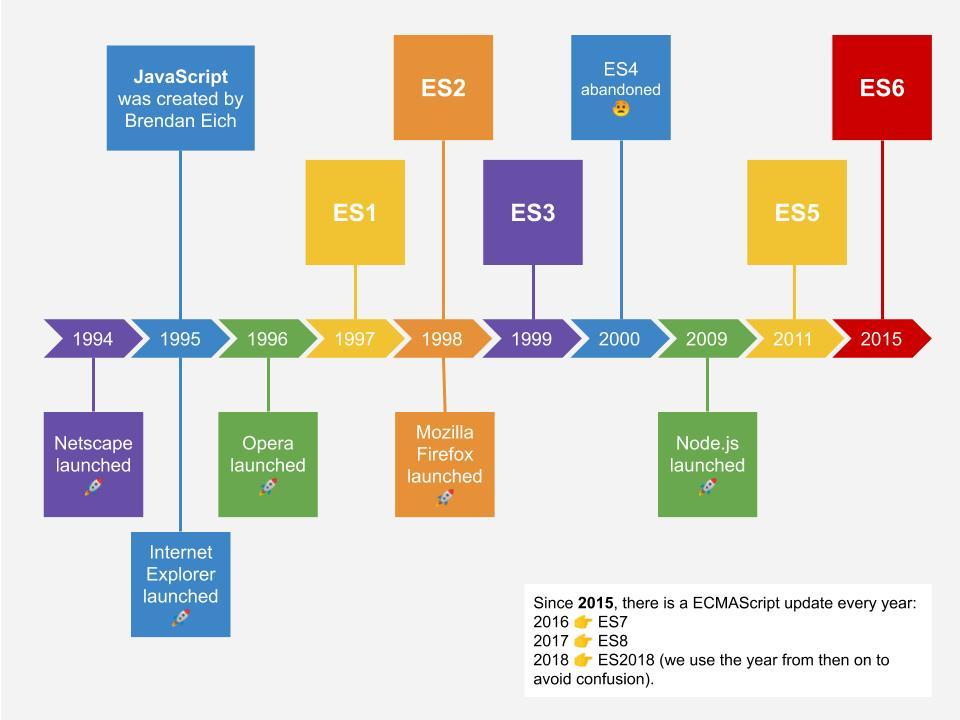

# es6-and-beyond

### ¿Qué es ésto?

Es un taller donde aprenderemos algunas de las _features_ que se han introducido en JavaScript desde 2015 y resolverás algunos mini retos para practicar lo que vamos aprendiendo.

### ¿Por qué aprender ES6?

¡ES6 ha sido la mayor actualización que JavaScript ha tenido desde 1997! Al introducir tantos cambios nos ha dado por llamarlo "JavaScript moderno".

Es importante decir que ES6 no es un lenguaje diferente sino una nueva versión de JavaScript. Aunque el objetivo de este taller es animarte a aprender y usar las nuevas _features_, queremos que no te sientas agobiada por aprender todo “del tirón”. Poco a poco irás parendiendo las partes nuevas que se han introducido.

### ¿Por qué ES6?

Brendan Eich creó JavaScript en 1995 por encargo de la compañía Netscape Communications con el fin de hacer la web interactiva. En 1996 Netscape propuso al _European Computer Manufacturers Association_ [ECMA](https://www.ecma-international.org/) JavaScript para crear un estándar para una _scripting language_, el cual fue publicado en 1997 como ECMA-262, la primera versión del lenguaje ECMAScript.

El estándar de ECMAScript establece reglas para nuevas _features_ lo que permite tener consistencia entre viejas y nuevas versiones del lenguaje.

Las versiones del estándar ECMAScript solían representarse indicando el número de la versión: ES6 pero es preferible hacerlo con el año de la versión ES2015 para evitar confusiones.

Quienes están encargados de aprobar los cambios que se introducirán al lenguaje es el comité TC39.

Los cambios que pretendan incluirse en el lenguaje deben pasar por 5 estados (0: strawperson, 1: proposal, 2: draft, 3: candidate, 4: Finished) para ser aprobados por el comité [TC39](https://tc39.es/).

### ¿Qué necesito para el taller?

- Tu portátil
- Puedes usar tu editor favorito, sin embargo te recomendamos usar [Repl.it](https://repl.it/) para escribir y ejecutar el código del taller.

Empecemos a conocer las nuevas _features_ que nos trajo ES2015 and beyond!!!

### [Go to Step 1 >>>>](https://github.com/node-girls/es6-and-beyond/blob/master/seccion-1-const-let-scopes.md)
